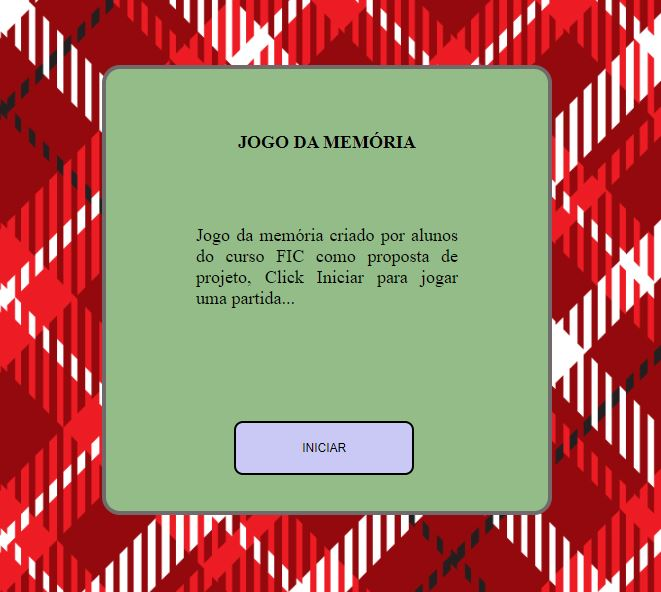
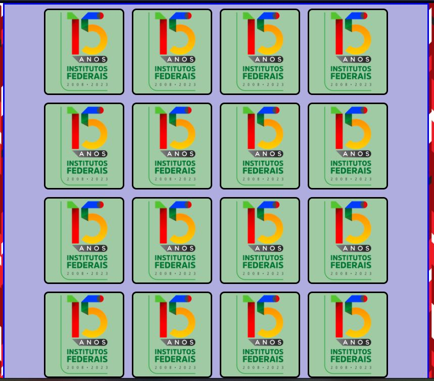
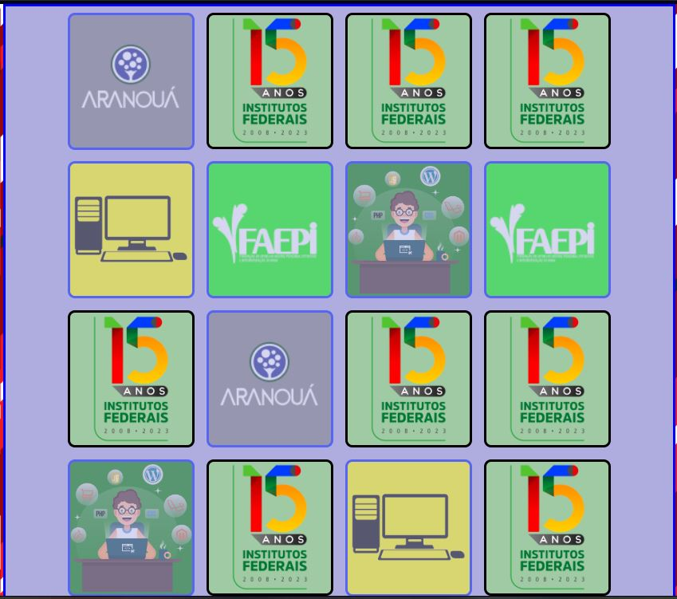
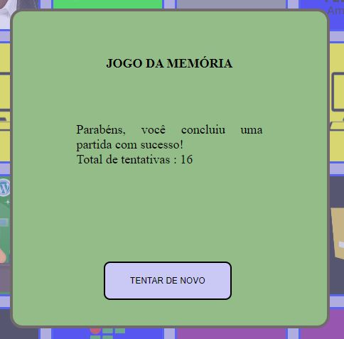
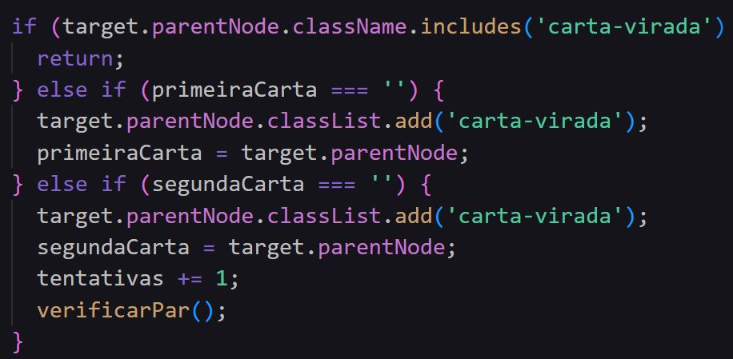
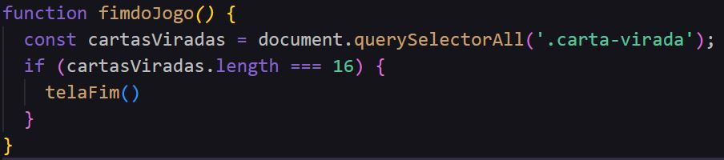
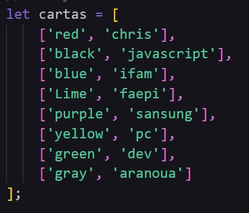
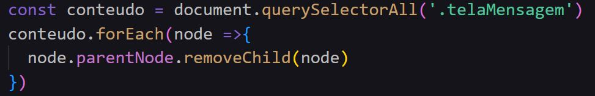

## Jogo da Memória
- Jogo desenvolvido para projeto FIC, objetivo era criar um jogo com estruturas estudadas no curso.

   [Projeto Hospedado Jogo da Memória](https://sailesc.github.io/jogo-da-memoria/)

  
#### Grupo : 
 - Nome do game : Jogo da Memoria FIC
 - Resumo : Um jogo bastante conhecido para estimular a memória, implementado usando html, css e js, no js aplicamos estrutuas de condição, funções e variaveis para fazer algo usual.
- Equipe: David Daniel e Saile Santos

#### Imagens do projeto
    1. Tela Inicial 

    2. Tela Princial

    3. Tela Fim

### Estruturas presentes no codigo:
    -> if : 

    -> função:

    -> array:

    -> forEach:

